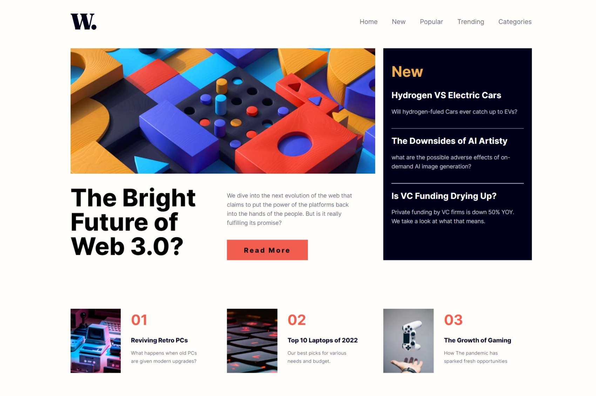

# Frontend Mentor - News homepage solution

This is a solution to the [News homepage challenge on Frontend Mentor](https://www.frontendmentor.io/challenges/news-homepage-H6SWTa1MFl). Frontend Mentor challenges help you improve your coding skills by building realistic projects. 

## Table of contents

  - [Screenshot](#screenshot)
  - [Links](#links)
  - [Author](#author)

### Screenshot

### Links

- Solution URL: [Solution](https://www.frontendmentor.io/solutions/responsive-home-news-page-with-htmlcss-and-javascript-fZ9lrKP_VZ)
- Live Site URL: [Live Site](https://ahmed-elgammal-900.github.io/News-Homepage/)

## Author

- Frontend Mentor - [@Ahmed-Elgammal-900](https://www.frontendmentor.io/profile/Ahmed-Elgammal-900)
